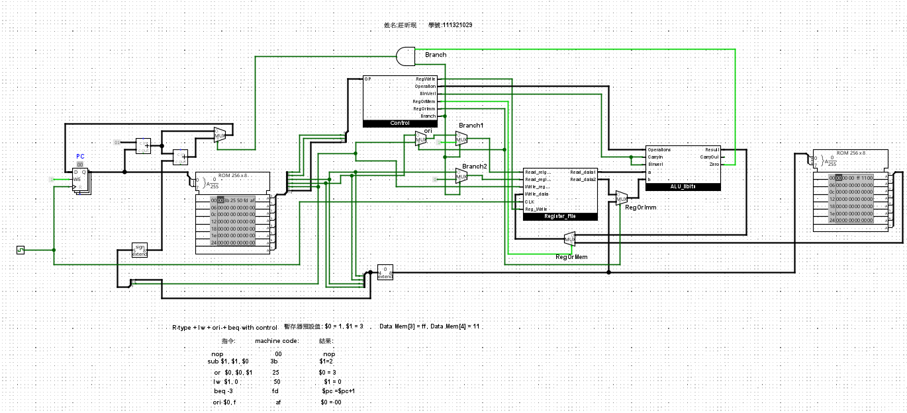

# single-cycle-8-bit-cpu
> A single-cycle 8-bit cpu with only two registers

---

## Instruction Set Architecture (ISA)
The processor follows a simple instruction encoding scheme where the operation can be identified by examining the top bits of each byte.

### Key Features
- Separate instruction and data memory
- Two general-purpose registers **($ra, $rb)**
- Supports arithmetic, logical, and branching instructions

### Instruction Encoding Table

| Instruction | 7 | 6 | 5 | 4 | 3 | 2 | 1 | 0 | Description |
|------------|---|---|---|---|---|---|---|---|-------------|
| nop        | 0 | 0 | 0 | 0 | 0 | 0 | 0 | 0 | No operation |
| and        | 0 | 0 | 1 | 0 | 0 | rd| ra| rb| $rd = $ra & $rb |
| or         | 0 | 0 | 1 | 0 | 1 | rd| ra| rb| $rd = $ra \| $rb |
| add        | 0 | 0 | 1 | 1 | 0 | rd| ra| rb| $rd = $ra + $rb |
| sub        | 0 | 0 | 1 | 1 | 1 | rd| ra| rb| $rd = $ra - $rb |
| lw         | 0 | 1 | 0 | rd| immediate | - | - | - | $rd = MEM[imm] |
| ori        | 1 | 0 | 1 | rd| immediate | - | - | - | $rd = $rd \| imm |
| beq        | 1 | 1 | 1 | offset | - | - | - | - | Branch if $ra == $rb |

### Notes
- **nop**: No operation is performed.  
- **Arithmetic operations**: Support basic logical and arithmetic functions (and, or, add, sub).  
- **lw**: Loads data from memory into the register $rd (immediate uses unsigned extension).  
- **ori**: Bitwise OR between the register and immediate value (immediate uses unsigned extension).  
- **beq**: Branches to an offset if the two registers are equal (offset uses signed extension).  

### Branching Behavior
The `beq` instruction operates similarly to MIPS:

```text
if $ra == $rb:
    PC = PC + 1 + offset
else:
    PC = PC + 1
````

---

## CPU Circuit Diagram

**CPU Circuit**


---

## How to Build and Simulate

Use **Logisim** to simulate this project:

1. **Clone the repository:**

```bash
git clone https://github.com/mike130193/Single-Cycle-8-bit-CPU.git
```

2. **Open the circuit in Logisim:**

   * Download and install Logisim from [Logisim website](http://www.cburch.com/logisim/).
   * Open `single-cycle-cpu.circ` from the project directory.

3. **Run the simulation:**

   * Click the Clock icon to step through instructions manually.
   * Observe the changes in registers and memory for each cycle.

```

